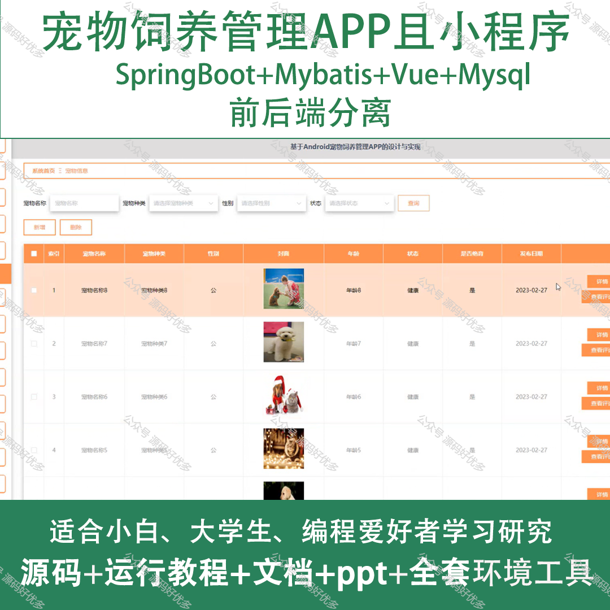
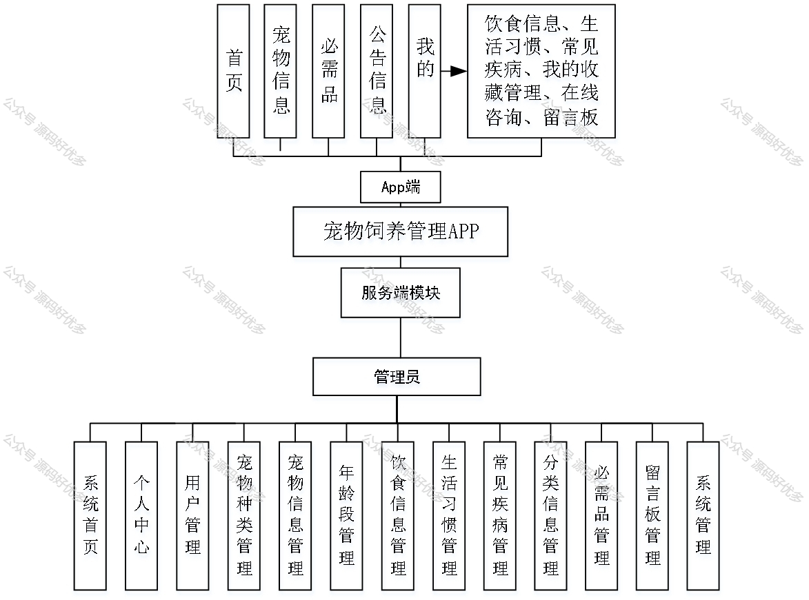
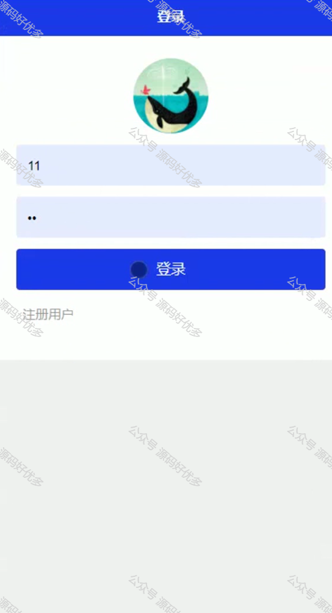
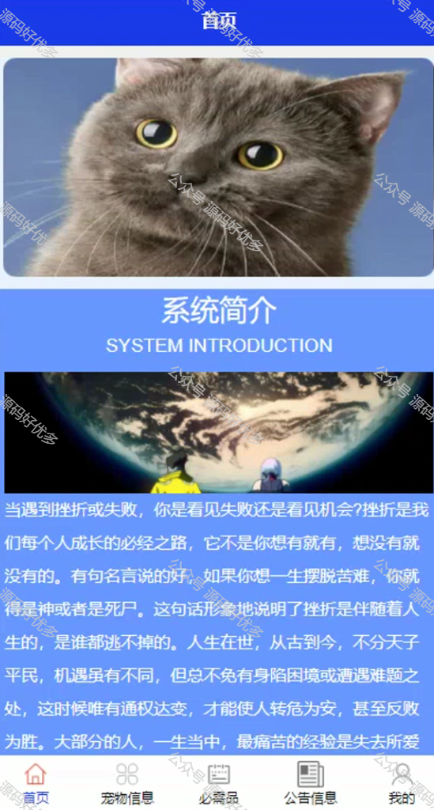
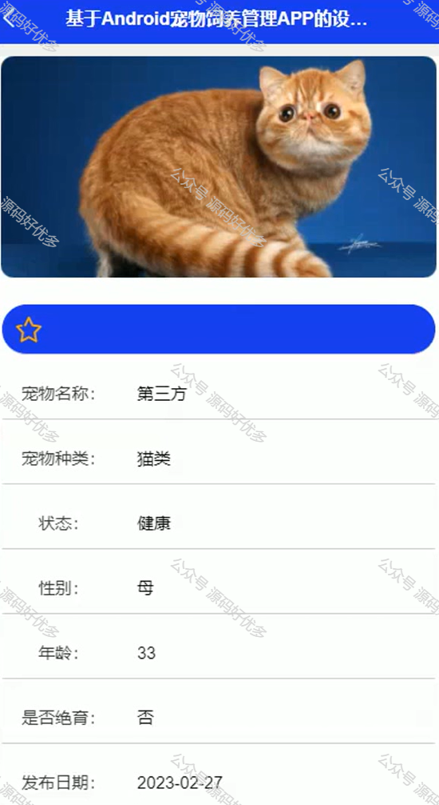
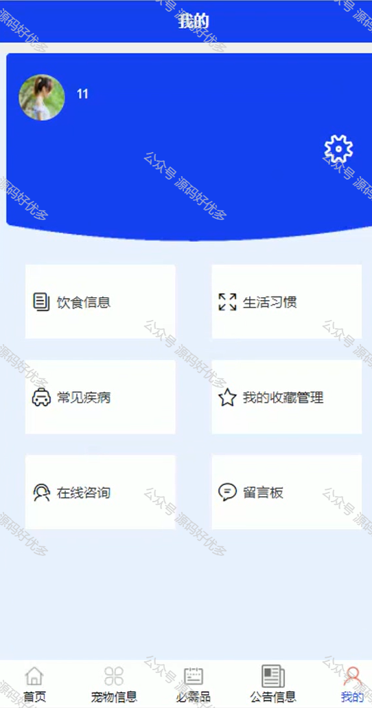
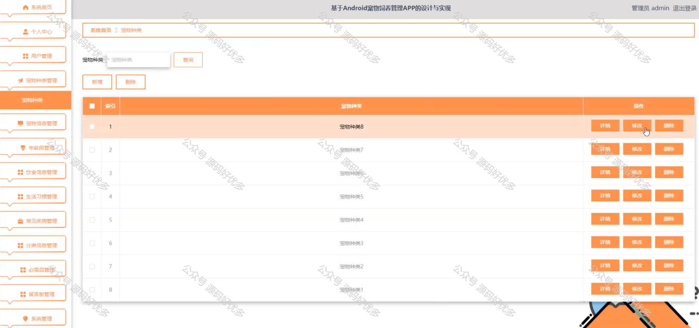
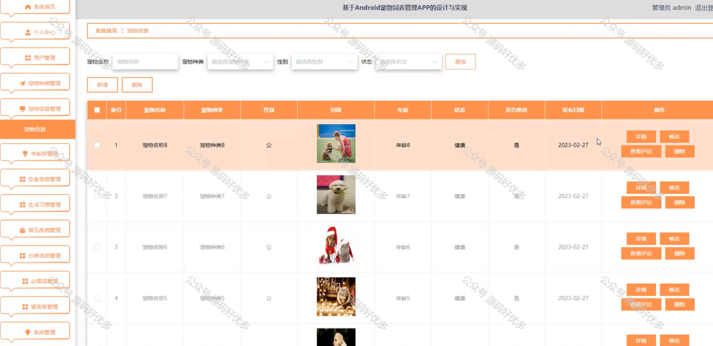
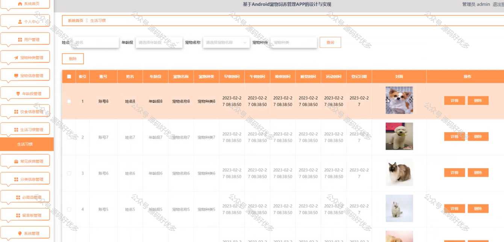
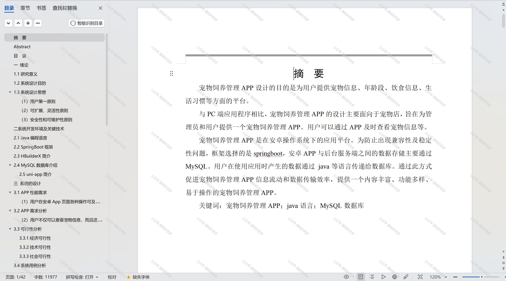

 
## 查看主页获取源码

> **作者介绍**： **✌**全网粉丝10W+本平台特邀作者、博客专家、CSDN新星计划导师、java领域优质创作者,博客之星、掘金/华为云/阿里云/InfoQ等平台优质作者、专注于项目实战 **✌**

  

### 一、作品包含

源码+数据库+设计文档万字+PPT+全套环境和工具资源+部署教程

### 二、项目技术

前端技术：Html、Css、Js、Vue、Element-ui

数据库：MySQL

后端技术：Java、Spring Boot、MyBatis

  

### 三、运行环境

开发工具：IDEA/eclipse + 微信开发者工具

数据库：MySQL5.7

数据库管理工具：Navicat10以上版本

环境配置软件： JDK1.8+Maven3.6.3

前端Nodejs：14

### 四、项目介绍
项目编号：mpweixinA032

随着社会经济的发展和人们生活水平的提高，宠物已经成为许多家庭的重要成员。宠物饲养管理小程序在这样的背景下应运而生，它旨在为宠物主人提供一站式的宠物养护、健康管理、用品购买等服务。小程序的推出，不仅方便了宠物主人对宠物的日常照料，还通过科普教育，增强了宠物主人的养宠知识和技能，从而提升宠物的生活质量，促进人与宠物的和谐共处。

前台用户功能：首页、宠物信息、必需品、公告信息、饮食信息、生活习惯、常见疾病、我的收藏管理、在线咨询、留言板。

后台管理员的功能：系统首页、个人中心、用户管理、宠物种类管理、宠物信息管理、年龄段管理、饮食信息管理、生活习惯管理、常见疾病管理、分类信息管理、必需品管理、留言板管理以及系统管理。

### 五、运行截图

  
